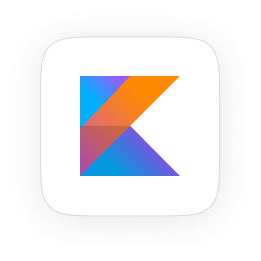
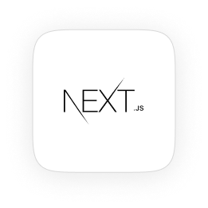
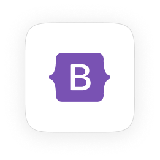
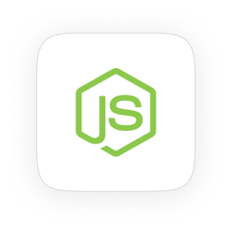
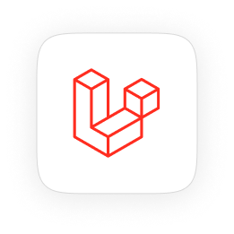
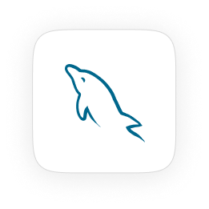
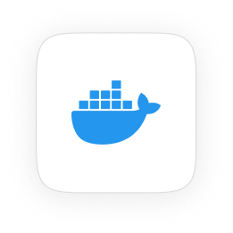
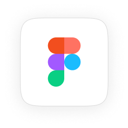
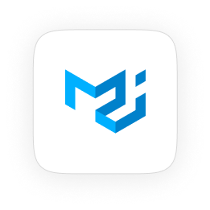

# Hi 👋 I'm Muhammad Rizki Sepriadi

Software Engineer specializing in **Android Development**, **Mobile Architecture**, and **Modern Application Development**.

- 📱 Android Developer (Kotlin, Jetpack Compose)
- 🚀 Flutter Developer
- 🏗️ Clean Architecture, MVVM, MVI
- 🔧 CI/CD, GitHub Actions, CircleCI
- 🔥 Firebase, REST API
- 🗄️ MySQL, Firestore, SQLite, Hive
- 🌱 Currently exploring Backend & Cloud Technologies

---

## Connect With Me

---

## Tech Stack

### Mobile Development

### Frontend

### Backend & Database

### Tools

<!-- 
---

## Featured Projects

### 📌 LoyaltyEase
Digital loyalty card application built with Flutter using Clean Architecture, Riverpod, Firebase Authentication, Firestore, and QR Scanner.

### 📌 Android MVVM Template
Scalable Android starter template using Kotlin, Jetpack Compose, MVVM, Koin, and CI/CD.

### 📌 Expert System Application
Android application implementing Backward Chaining and Certainty Factor methods using MVVM Architecture. -->

---

## GitHub Statistics

---

## Certifications

- Android Developer Expert
- IDCamp Android Development
- Google Developer Groups on Campus (GDGoC)
- Mobile Development Certifications

---

## Contact

📧 Email: muhammadrizkisepriadi@gmail.com

🔗 LinkedIn: https://linkedin.com/in/rizkisepriadi

🌐 Portfolio: https://kisep-gh-pages.netlify.app
